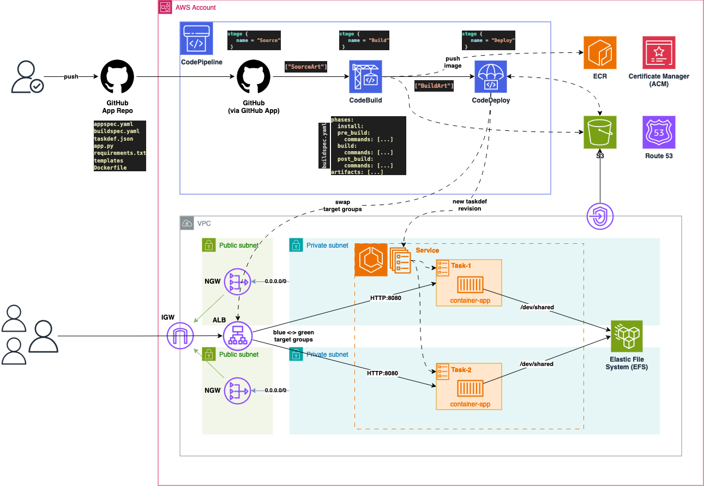

# Amazon ECS running on FARGATE with CI/CD

## Arch

<p align="center"></p>

## Blog post

## Provisioning with OpenTofu

Execute:

```sh
tofu init
tofu plan --var-file variables.tfvars
tofu apply --var-file variables.tfvars
```

<!-- BEGIN_TF_DOCS -->
## Requirements

No requirements.

## Providers

| Name | Version |
|------|---------|
| <a name="provider_aws"></a> [aws](#provider\_aws) | n/a |

## Modules

| Name | Source | Version |
|------|--------|---------|
| <a name="module_acm"></a> [acm](#module\_acm) | terraform-aws-modules/acm/aws | >= v2.0 |
| <a name="module_alb"></a> [alb](#module\_alb) | terraform-aws-modules/alb/aws | >= 5.0 |
| <a name="module_s3_bucket"></a> [s3\_bucket](#module\_s3\_bucket) | terraform-aws-modules/s3-bucket/aws | >= 3.10.1 |
| <a name="module_vpc"></a> [vpc](#module\_vpc) | terraform-aws-modules/vpc/aws | >=2.0 |

## Resources

| Name | Type |
|------|------|
| [aws_appautoscaling_policy.scale_in](https://registry.terraform.io/providers/hashicorp/aws/latest/docs/resources/appautoscaling_policy) | resource |
| [aws_appautoscaling_policy.scale_out](https://registry.terraform.io/providers/hashicorp/aws/latest/docs/resources/appautoscaling_policy) | resource |
| [aws_appautoscaling_target.this](https://registry.terraform.io/providers/hashicorp/aws/latest/docs/resources/appautoscaling_target) | resource |
| [aws_cloudwatch_log_group.app](https://registry.terraform.io/providers/hashicorp/aws/latest/docs/resources/cloudwatch_log_group) | resource |
| [aws_cloudwatch_metric_alarm.cpu_utilization_high](https://registry.terraform.io/providers/hashicorp/aws/latest/docs/resources/cloudwatch_metric_alarm) | resource |
| [aws_cloudwatch_metric_alarm.cpu_utilization_low](https://registry.terraform.io/providers/hashicorp/aws/latest/docs/resources/cloudwatch_metric_alarm) | resource |
| [aws_codebuild_project.codebuild](https://registry.terraform.io/providers/hashicorp/aws/latest/docs/resources/codebuild_project) | resource |
| [aws_codedeploy_app.ecs_app](https://registry.terraform.io/providers/hashicorp/aws/latest/docs/resources/codedeploy_app) | resource |
| [aws_codedeploy_deployment_group.ecs_deployment_group](https://registry.terraform.io/providers/hashicorp/aws/latest/docs/resources/codedeploy_deployment_group) | resource |
| [aws_codepipeline.codepipeline](https://registry.terraform.io/providers/hashicorp/aws/latest/docs/resources/codepipeline) | resource |
| [aws_codestarconnections_connection.github_connection](https://registry.terraform.io/providers/hashicorp/aws/latest/docs/resources/codestarconnections_connection) | resource |
| [aws_ecr_repository.app_repository](https://registry.terraform.io/providers/hashicorp/aws/latest/docs/resources/ecr_repository) | resource |
| [aws_ecs_cluster.this](https://registry.terraform.io/providers/hashicorp/aws/latest/docs/resources/ecs_cluster) | resource |
| [aws_ecs_service.this](https://registry.terraform.io/providers/hashicorp/aws/latest/docs/resources/ecs_service) | resource |
| [aws_ecs_task_definition.this](https://registry.terraform.io/providers/hashicorp/aws/latest/docs/resources/ecs_task_definition) | resource |
| [aws_efs_file_system.this](https://registry.terraform.io/providers/hashicorp/aws/latest/docs/resources/efs_file_system) | resource |
| [aws_efs_mount_target.this](https://registry.terraform.io/providers/hashicorp/aws/latest/docs/resources/efs_mount_target) | resource |
| [aws_iam_policy.task_execution_policy](https://registry.terraform.io/providers/hashicorp/aws/latest/docs/resources/iam_policy) | resource |
| [aws_iam_policy.task_policy](https://registry.terraform.io/providers/hashicorp/aws/latest/docs/resources/iam_policy) | resource |
| [aws_iam_role.codebuild_role](https://registry.terraform.io/providers/hashicorp/aws/latest/docs/resources/iam_role) | resource |
| [aws_iam_role.codedeploy_role](https://registry.terraform.io/providers/hashicorp/aws/latest/docs/resources/iam_role) | resource |
| [aws_iam_role.codepipeline_role](https://registry.terraform.io/providers/hashicorp/aws/latest/docs/resources/iam_role) | resource |
| [aws_iam_role.task_execution_role](https://registry.terraform.io/providers/hashicorp/aws/latest/docs/resources/iam_role) | resource |
| [aws_iam_role.task_role](https://registry.terraform.io/providers/hashicorp/aws/latest/docs/resources/iam_role) | resource |
| [aws_iam_role_policy.codebuild_policy](https://registry.terraform.io/providers/hashicorp/aws/latest/docs/resources/iam_role_policy) | resource |
| [aws_iam_role_policy.codedeploy_policy](https://registry.terraform.io/providers/hashicorp/aws/latest/docs/resources/iam_role_policy) | resource |
| [aws_iam_role_policy.codepipeline_policy](https://registry.terraform.io/providers/hashicorp/aws/latest/docs/resources/iam_role_policy) | resource |
| [aws_iam_role_policy_attachment.task_execution_policy_attach](https://registry.terraform.io/providers/hashicorp/aws/latest/docs/resources/iam_role_policy_attachment) | resource |
| [aws_iam_role_policy_attachment.task_policy_attach](https://registry.terraform.io/providers/hashicorp/aws/latest/docs/resources/iam_role_policy_attachment) | resource |
| [aws_lb_listener.https](https://registry.terraform.io/providers/hashicorp/aws/latest/docs/resources/lb_listener) | resource |
| [aws_lb_listener_rule.app](https://registry.terraform.io/providers/hashicorp/aws/latest/docs/resources/lb_listener_rule) | resource |
| [aws_lb_target_group.blue](https://registry.terraform.io/providers/hashicorp/aws/latest/docs/resources/lb_target_group) | resource |
| [aws_lb_target_group.green](https://registry.terraform.io/providers/hashicorp/aws/latest/docs/resources/lb_target_group) | resource |
| [aws_route53_record.app](https://registry.terraform.io/providers/hashicorp/aws/latest/docs/resources/route53_record) | resource |
| [aws_s3_bucket_public_access_block.codepipeline_bucket_pab](https://registry.terraform.io/providers/hashicorp/aws/latest/docs/resources/s3_bucket_public_access_block) | resource |
| [aws_security_group.alb](https://registry.terraform.io/providers/hashicorp/aws/latest/docs/resources/security_group) | resource |
| [aws_security_group.app](https://registry.terraform.io/providers/hashicorp/aws/latest/docs/resources/security_group) | resource |
| [aws_security_group.efs](https://registry.terraform.io/providers/hashicorp/aws/latest/docs/resources/security_group) | resource |
| [aws_vpc_endpoint.s3_gw_endpoint](https://registry.terraform.io/providers/hashicorp/aws/latest/docs/resources/vpc_endpoint) | resource |
| [aws_caller_identity.current](https://registry.terraform.io/providers/hashicorp/aws/latest/docs/data-sources/caller_identity) | data source |
| [aws_iam_policy_document.codebuild_assume_role](https://registry.terraform.io/providers/hashicorp/aws/latest/docs/data-sources/iam_policy_document) | data source |
| [aws_iam_policy_document.codedeploy_assume_role](https://registry.terraform.io/providers/hashicorp/aws/latest/docs/data-sources/iam_policy_document) | data source |
| [aws_iam_policy_document.codepipeline_assume_role](https://registry.terraform.io/providers/hashicorp/aws/latest/docs/data-sources/iam_policy_document) | data source |
| [aws_iam_policy_document.codepipeline_policy](https://registry.terraform.io/providers/hashicorp/aws/latest/docs/data-sources/iam_policy_document) | data source |
| [aws_route53_zone.this](https://registry.terraform.io/providers/hashicorp/aws/latest/docs/data-sources/route53_zone) | data source |

## Inputs

| Name | Description | Type | Default | Required |
|------|-------------|------|---------|:--------:|
| <a name="input_aws_region"></a> [aws\_region](#input\_aws\_region) | AWS Region (e.g. us-east-1, us-west-2, sa-east-1, us-east-2) | `string` | n/a | yes |
| <a name="input_azs"></a> [azs](#input\_azs) | AWS Availability Zones | `list(string)` | n/a | yes |
| <a name="input_desired_count"></a> [desired\_count](#input\_desired\_count) | The number of instances of Fargate tasks to keep running. | `number` | n/a | yes |
| <a name="input_env_prefix"></a> [env\_prefix](#input\_env\_prefix) | Environment prefix for all resources to be created. | `string` | n/a | yes |
| <a name="input_environment"></a> [environment](#input\_environment) | Name of the application environment. | `string` | n/a | yes |
| <a name="input_github_branch"></a> [github\_branch](#input\_github\_branch) | GitHub branch. | `string` | n/a | yes |
| <a name="input_github_repo"></a> [github\_repo](#input\_github\_repo) | GitHub repo (some-user/my-repo). | `string` | n/a | yes |
| <a name="input_log_retention_in_days"></a> [log\_retention\_in\_days](#input\_log\_retention\_in\_days) | The number of days to retain CloudWatch logs. | `number` | n/a | yes |
| <a name="input_max_task"></a> [max\_task](#input\_max\_task) | Maximum number of tasks. | `number` | n/a | yes |
| <a name="input_min_task"></a> [min\_task](#input\_min\_task) | Minimum number of tasks. | `number` | n/a | yes |
| <a name="input_private_subnet_cidrs"></a> [private\_subnet\_cidrs](#input\_private\_subnet\_cidrs) | List of CIDR blocks for private subnets. | `list(string)` | n/a | yes |
| <a name="input_public_subnet_cidrs"></a> [public\_subnet\_cidrs](#input\_public\_subnet\_cidrs) | List of CIDR blocks for public subnets. | `list(string)` | n/a | yes |
| <a name="input_scaling_in_adjustment"></a> [scaling\_in\_adjustment](#input\_scaling\_in\_adjustment) | Number of tasks to scale down. | `number` | n/a | yes |
| <a name="input_scaling_in_cooldown"></a> [scaling\_in\_cooldown](#input\_scaling\_in\_cooldown) | Cooldown time after downscaling. | `number` | n/a | yes |
| <a name="input_scaling_out_adjustment"></a> [scaling\_out\_adjustment](#input\_scaling\_out\_adjustment) | Number of tasks to scale up. | `number` | n/a | yes |
| <a name="input_scaling_out_cooldown"></a> [scaling\_out\_cooldown](#input\_scaling\_out\_cooldown) | Cooldown time after upscaling. | `number` | n/a | yes |
| <a name="input_site_domain"></a> [site\_domain](#input\_site\_domain) | The primary domain name of the website. | `string` | n/a | yes |
| <a name="input_tags"></a> [tags](#input\_tags) | AWS Tags to add to all resources created. | `map(string)` | n/a | yes |
| <a name="input_task_cpu"></a> [task\_cpu](#input\_task\_cpu) | The number of CPU units used by the task. | `number` | n/a | yes |
| <a name="input_task_cpu_high_threshold"></a> [task\_cpu\_high\_threshold](#input\_task\_cpu\_high\_threshold) | CPU threshold for upscaling. | `number` | n/a | yes |
| <a name="input_task_cpu_low_threshold"></a> [task\_cpu\_low\_threshold](#input\_task\_cpu\_low\_threshold) | CPU threshold for downscaling. | `number` | n/a | yes |
| <a name="input_task_memory"></a> [task\_memory](#input\_task\_memory) | The amount (in MiB) of memory used by the task. | `number` | n/a | yes |
| <a name="input_vpc_cidr"></a> [vpc\_cidr](#input\_vpc\_cidr) | The VPC CIDR block. | `string` | n/a | yes |

## Outputs

| Name | Description |
|------|-------------|
| <a name="output_route53_record_fqdn"></a> [route53\_record\_fqdn](#output\_route53\_record\_fqdn) | Route53 record. |
| <a name="output_s3_bucket_arn"></a> [s3\_bucket\_arn](#output\_s3\_bucket\_arn) | The ARN of the bucket. Will be of format arn:aws:s3:::bucketname. |
<!-- END_TF_DOCS -->

---